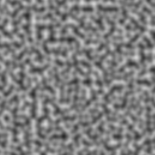

# Terrain Generator for D&D

A TypeScript implementation of Perlin noise for procedural terrain generation with an interactive web interface. Generate natural-looking terrain patterns for D&D campaigns and learn noise generation algorithms.



## Overview

This project implements Perlin noise from scratch to generate realistic terrain patterns. Perlin noise works by:

1. **Creating a grid of random gradient vectors** - Each grid point has a random direction vector
2. **Calculating dot products** - For any sample point, compute how aligned it is with surrounding gradients  
3. **Interpolating values** - Smoothly blend the dot products to create continuous, natural-looking noise

The result is organic, flowing patterns perfect for terrain generation rather than harsh random noise.

## Features

- ✅ **Interactive Web Interface** - Real-time terrain generation in browser
- ✅ **Pure TypeScript Perlin noise implementation** - Built from scratch for learning
- ✅ **Responsive Design** - Works on desktop and mobile devices
- ✅ **Live Parameter Controls** - Adjust image size (64-1024px) and scale factor (0.01-0.3)
- ✅ **Canvas Rendering** - Real-time visualization with dynamic sizing
- ✅ **Command Line Tool** - PNG export for offline use
- ✅ **Comprehensive Test Suite** - 96%+ code coverage with robust error handling
- ✅ **Modern Development Setup** - TypeScript, Jest, Prettier, Husky pre-commit hooks

## Installation

### Prerequisites
- Node.js (v16 or higher)
- npm or yarn

### Quick Start
```bash
# Clone the repository
git clone https://github.com/rileylum/terrain-gen.git
cd terrain-gen

# Install dependencies
npm install

# Start the development server
npm run dev
```

Then open `http://localhost:8000` in your browser to use the interactive terrain generator!

### Command Line Usage
```bash
# Compile TypeScript
npx tsc

# Generate terrain PNG
npm start
```

### Development
```bash
# Run tests
npm test

# Run tests with coverage
npm run test:coverage

# Format code
npm run format

# Check formatting
npm run format:check
```

## Dependencies

### Core Dependencies
- **sharp**: High-performance image processing for PNG generation
- **@types/sharp**: TypeScript definitions for Sharp

### Development Dependencies
- **typescript**: TypeScript compiler and type checking
- **jest**: Testing framework with comprehensive coverage reporting
- **jest-environment-jsdom**: Browser environment simulation for testing
- **prettier**: Code formatting for TypeScript, HTML, and CSS
- **husky**: Git hooks for automated code quality checks
- **lint-staged**: Run formatting and tests on staged files
- **express**: Development server for proper ES module serving
- **@types/express**: TypeScript definitions for Express

## Usage

### Web Interface

The easiest way to generate terrain is through the web interface:

1. **Start the server**: `npm run dev`
2. **Open your browser**: Navigate to `http://localhost:8000`
3. **Adjust parameters**:
   - **Image Size**: Use the slider to select resolution (64px to 1024px)
   - **Scale Factor**: Control noise frequency (0.01 to 0.3)
   - Lower scale = smoother, larger patterns
   - Higher scale = more detailed, smaller features
4. **Generate**: Click "Generate Image" to create new terrain
5. **Real-time preview**: Watch the canvas update instantly

### Programmatic Usage

For integration into other projects:

```typescript
import { createPerlinNoise } from './perlin';

const imageSize = 256;
const scaleFactor = 0.1; // Controls noise frequency
const imageBuffer = createPerlinNoise(imageSize, scaleFactor);

// imageBuffer is a Uint8Array with grayscale values (0-255)
// Can be used with Canvas API, image libraries, or file output
```

### Parameter Guide

- **imageSize**: Output image dimensions in pixels
  - **64-128px**: Small textures, quick generation
  - **256px**: Standard size, good balance of detail and performance
  - **512-1024px**: High detail, slower generation

- **scaleFactor**: Noise frequency and zoom level
  - **0.01-0.05**: Very smooth, continental-scale features
  - **0.05-0.1**: Medium features, good for terrain heightmaps
  - **0.1-0.2**: Detailed features, surface textures
  - **0.2-0.3**: Fine detail, very noisy patterns

### Key Functions

- `createPerlinNoise(size, scale)`: Main function to generate noise
- `sampleNoise(coordinate, vectorGrid)`: Sample noise at specific coordinates
- `createVectorGrid(gridSize)`: Generate the gradient vector grid
- `noiseToPixel(noiseValue)`: Convert noise values [-1,1] to pixel values [0,255]

## Project Structure

```
terrain-gen/
├── src/
│   ├── index.ts              # CLI tool for PNG generation
│   ├── browser.ts            # Web interface functionality
│   ├── perlin.ts            # Core Perlin noise implementation
│   ├── types.ts             # TypeScript type definitions
│   └── __tests__/           # Test suite
│       ├── browser.test.ts  # Browser functionality tests
│       ├── index.test.ts    # CLI tool tests
│       └── perlin.test.ts   # Core algorithm tests
├── public/
│   ├── index.html           # Web interface HTML
│   └── style.css            # Responsive styling
├── dist/                    # Compiled JavaScript (generated)
├── dev-server.js            # Express development server
├── jest.config.js           # Test configuration
├── tsconfig.json            # TypeScript configuration
└── .prettierrc              # Code formatting rules
```

## Roadmap

### Phase 1: User Interface ✅ **COMPLETED**
- [x] **Web Frontend** - Browser-based terrain generator
- [x] **Parameter Controls** - Sliders and inputs for all generation settings
- [x] **Real-time Generation** - Instant terrain updates with canvas rendering
- [x] **Responsive Design** - Mobile and desktop compatibility

### Phase 2: Enhanced Noise Generation
- [ ] **Octave Layering** - Combine multiple noise layers for realistic terrain
- [ ] **Fractal Noise** - Add detail at multiple scales
- [ ] **Noise Variants** - Implement Simplex noise and other algorithms

### Phase 3: Terrain Features
- [ ] **Height Thresholding** - Convert noise to terrain types (water, plains, hills, mountains)
- [ ] **Biome Generation** - Use temperature/moisture maps for biome placement
- [ ] **River Generation** - Hydraulic erosion and water flow simulation
- [ ] **Settlement Placement** - Algorithmic city and town positioning

### Phase 4: D&D Integration
- [ ] **Hex Grid Conversion** - Convert square grid to hexagonal for D&D maps
- [ ] **Scale Configuration** - Support for different map scales (regional, local, battle)
- [ ] **Encounter Zones** - Generate encounter difficulty based on terrain
- [ ] **Resource Distribution** - Place natural resources and points of interest

### Phase 5: Visualization & Export
- [ ] **Color Mapping** - Realistic terrain colors and elevation shading
- [ ] **Contour Lines** - Topographic map generation
- [ ] **Multiple Export Formats** - SVG, GeoJSON, Roll20 integration
- [ ] **Interactive Preview** - Real-time parameter adjustment

### Phase 6: Extending User Interface
- [ ] **Preset Templates** - Common terrain types and D&D scenarios
- [ ] **Batch Generation** - Generate multiple map variations


## Development Workflow

This project follows modern development practices:

### Code Quality
- **TypeScript**: Full type safety with strict compilation
- **Testing**: Comprehensive test suite with 96%+ coverage
- **Formatting**: Automated code formatting with Prettier
- **Git Hooks**: Pre-commit checks for formatting and tests
- **ES Modules**: Modern JavaScript module system

### Testing
```bash
# Run all tests
npm test

# Watch mode for development
npm run test:watch

# Coverage report
npm run test:coverage
```

### Code Style
```bash
# Format all files
npm run format

# Check formatting without changes
npm run format:check
```

All code is automatically formatted on commit using Husky and lint-staged.

## Contributing

This is primarily a learning project, but contributions are welcome! Areas of interest:

- Algorithm optimizations and performance improvements
- Additional noise types (Simplex, Worley, etc.)
- D&D-specific features and integration
- Enhanced UI/UX improvements
- Documentation and educational content
- Code review and constructive feedback

## License

MIT License - feel free to use this for your campaigns!
